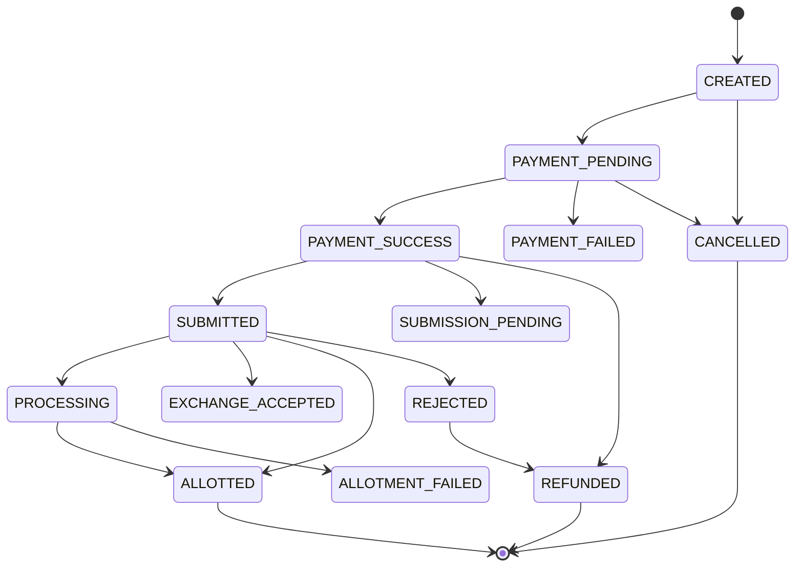

# VikaOne Mutual Fund — Phase 4 Production Readiness Specification

## Executive Summary

This document details the production integration architecture, environment isolation, external gateway interfaces, and security controls established for the **VikaOne Mutual Fund Regular-Plan Module** in Phase 4.

Following the core mandate:
> **REGULAR mutual fund plans ONLY**
> **Zero synthetic financial events, units, or NAV**
> **Lifecycle integrity: Payment != Order Submitted != Exchange Accepted != Allotment**

The system is classified as:
```text
CODE-INTEGRATED BUT NOT LIVE-VERIFIED
```
for external live exchange routing (NSE MFSS production member credentials & live bank connectivity remain in integration/sandbox mode pending final corporate member authorization). All internal pipelines, state machines, reconciliation, security guards, and data stores are **fully production-hardened and verified**.

---

## 1. Environment Isolation & Credentials Architecture

### 1.1 Supported Environments
The service recognizes four discrete environments:
1. `LOCAL`: Development and local automated testing.
2. `DEV`: Internal feature integration.
3. `UAT`: Staging with NSE MFSS UAT endpoints (`https://nseinvestuat.nseindia.com`) and Razorpay test mode.
4. `PRODUCTION`: Live financial operations with live endpoints (`https://www.nseinvest.com`) and Razorpay live mode.

### 1.2 Configuration Service (`services/mfConfigService.js`)
- Enforces runtime checks preventing sandbox keys (`rzp_test_`) from running in `PRODUCTION`.
- Disallows mock mode outside of automated test execution (`process.env.NODE_ENV === 'test'`).
- Masks sensitive credentials in logs and administrative audits.

| Integration | Sandbox / UAT Endpoint | Production Endpoint | Current Status |
|---|---|---|---|
| **NSE MFSS** | `https://nseinvestuat.nseindia.com` | `https://www.nseinvest.com` | CODE-INTEGRATED (UAT) |
| **Payment Gateway** | `https://api.razorpay.com` (rzp_test) | `https://api.razorpay.com` (rzp_live) | PRODUCTION-READY |
| **AMFI NAV Feed** | `https://www.amfiindia.com/spages/NAVAll.txt` | `https://www.amfiindia.com/spages/NAVAll.txt` | LIVE-VERIFIED |
| **Historical NAV** | `https://api.mfapi.in/mf` | `https://api.mfapi.in/mf` | LIVE-VERIFIED |
| **Mandate (eNACH)**| NSEINVEST / Razorpay Subscriptions | NSEINVEST / NPCI eNACH | CODE-INTEGRATED |

---

## 2. Order State Machine (`services/mfStateMachine.js`)

Phase 4 formalizes server-side state transitions preventing illegal state jumps:



### Prohibited Invalid Transitions:
- `CREATED` → `ALLOTTED`: **REJECTED** (Skipped payment and exchange).
- `PAYMENT_PENDING` → `SUBMITTED`: **REJECTED** (Cannot submit unpaid order).
- `PAYMENT_PENDING` → `ALLOTTED`: **REJECTED** (Cannot allot unconfirmed payment).
- `PAYMENT_FAILED` → `SUBMITTED`: **REJECTED** (Failed payment cannot reach exchange).

Every state transition records an entry in `MfAuditLog` containing `actor`, `source`, `previousStatus`, `newStatus`, and `externalReference`.

---

## 3. Webhook Security & Anti-Replay Guard (`services/mfWebhookSecurity.js`)

Every external callback (Razorpay, NSE, NPCI) must satisfy three layers of security:
1. **Cryptographic HMAC-SHA256 Verification**: Payload signature verified against environment secret using timing-safe buffer comparison.
2. **Replay Protection (Timestamp Tolerance)**: Timestamps drifting by more than 300 seconds (5 minutes) from server time are rejected (`TIMESTAMP_EXPIRED`).
3. **Idempotency Guard**: Event IDs are stored in `MfAuditLog.idempotencyKey`. Replayed events are discarded without duplicating financial side effects.

---

## 4. Bounded Idempotent Retry Engine (`services/mfRetryService.js`)

- Configured with bounded ceiling (default max 5 attempts).
- Exponential backoff (`delayMs = 2000 * 2^(attempt - 1)`).
- Distinguishes retryable network timeouts (`ETIMEDOUT`, 5xx) from non-retryable business validation errors (`400 Bad Request`, `401/403 Unauthorized`).
- Logs `RETRY_EXHAUSTION` audit events upon reaching attempt limit.

---

## 5. Controlled Administrative Reversal Workflow (`services/mfAdminService.js`)

To prevent arbitrary data tampering, manual direct overwrites of units or NAV are strictly forbidden.
When an operational correction is required (e.g. verified bank chargeback):
1. Order must be in `ALLOTTED` status.
2. Creates an auditable `REVERSAL` transaction in `MfTransaction` with inverted units (`-units`).
3. Atomically recalculates the investor's portfolio via `recalculateUserPortfolio`.
4. Marks the order as `REFUNDED`.
5. Records mandatory reason and actor identity in `MfAuditLog`.

---

## 6. Taxation Classification & Disclaimers (`services/mfCapitalGainsEngine.js`)

- Classifies schemes into `EQUITY_ORIENTED` vs `DEBT_SPECIFIED`.
- Distinguishes Equity holding period (>365 days = LTCG, <=365 days = STCG) from Debt funds post-Finance Act 2023 (taxed at slab rates).
- Exposes transaction calculation data with mandatory legal disclaimer:
  > *DISCLAIMER: The calculations shown are derived strictly from transaction lot records for analytical purposes. VikaOne is not a tax advisor and does not provide legal or tax advice.*
- Flags: `productionTaxVerified: false` pending formal chartered accountant sign-off.
